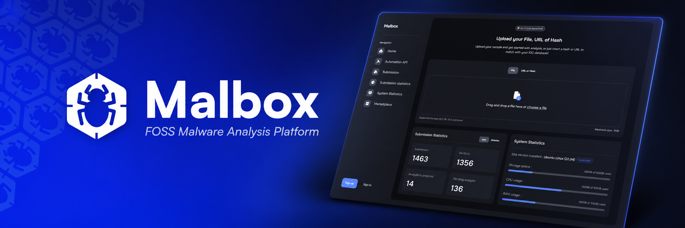

Malbox is an open-source malware analysis platform designed to provide security researchers, malware analysts, and cybersecurity teams with a powerful, extensible environment for analyzing files and understanding their behavior.

[Documentation](https://docs.malbox.app/) • [Installation](https://docs.malbox.app/quickstart) • [Reference](https://docs.malbox.app/reference) • [Crate Docs](https://crates.malbox.app/)

